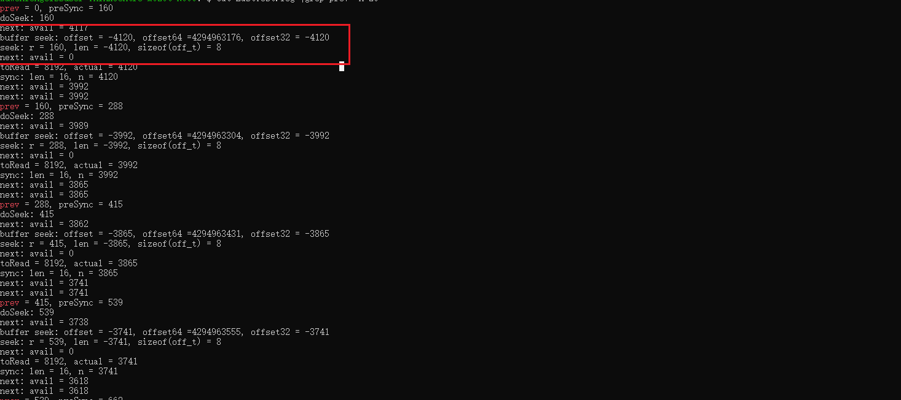

#  问题描述
在32位系统上， 读写文件过程，seek 调用跟期望的不一致， 文件没有被正确读写，导致测试用例失败。
通过在代码里加打印，发现主要是在seek 函数打印传入的数据异常。如下图所示：

本来传入的是-4120, 但是打印的结果是4294963176. 

于是，判断是类型转换导致的。

#  调试记录

经过调试，发现下面两个函数类型的差异：

被调函数定义是seek(size_t len)
```c++
# class FileBufferCopyIn
void seek(size_t len) final {
    // 而系统的lseek 转化成了off_t 类型
    off_t r = ::lseek(fd_, len, SEEK_CUR);
    if (r == static_cast<off_t>(-1)) {
        throw Exception(boost::format("Cannot skip file: %1%") % strerror(errno));
    }
}
```

调用处代码传的是int64_t
```c++
# class BufferCopyInInputStream
 void seek(int64_t position) final {
    // BufferCopyIn::seek is relative to byteCount_, whereas position is
    // absolute.
    in_->seek(position - byteCount_ - available_);
    byteCount_ = position;
    available_ = 0;
}
```
整个过程的发生了int64_t --> size_t  --> off_t 的转换。


我们在代码里打印int64_t, size_t, off_t的大小
```c++
template<int Size> class CalcSize;

void test() {
    CalcSize<sizeof(int64_t)>();
    CalcSize<sizeof(size_t)>();
    CalcSize<sizeof(off_t)>();
}
```

编译之后，发现size_t 是4字节的， off_t 是8字节的
```shell
/data/local/tmp/lycium/main/avrocpp/avro-release-1.11.1/lang/c++/test/DataFileTests.cc:270:9: error: implicit instantiation of undefined template 'DataFileTest::CalcSize<8>'
        CalcSize<sizeof(int64_t)>();
        ^

/data/local/tmp/lycium/main/avrocpp/avro-release-1.11.1/lang/c++/test/DataFileTests.cc:271:9: error: implicit instantiation of undefined template 'DataFileTest::CalcSize<4>'
        CalcSize<sizeof(size_t)>();
        ^
/data/local/tmp/lycium/main/avrocpp/avro-release-1.11.1/lang/c++/test/DataFileTests.cc:272:9: error: implicit instantiation of undefined template 'DataFileTest::CalcSize<8>'
        CalcSize<sizeof(off_t)>();
        ^
/data/local/tmp/lycium/main/avrocpp/avro-release-1.11.1/lang/c++/test/DataFileTests.cc:267:30: note: template is declared here
```

# 结论
由上面可知，是avro本身的代码在调用过程中类型不一致导致的。发生了 int64_t（64） --> size_t（32）  --> off_t（64） 的转换。这就导致了数据被截断了。

当传入为负数时， 32位的size_t转化成64位的off_t 数据出错。


